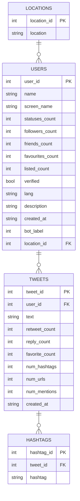

# DS 4320 Project 1: Detecting Bot Accounts on Twitter

## Table of Contents
- [Executive Summary](#executive-summary)
- [Problem Definition](#problem-definition)
- [Domain Exposition](#domain-exposition)
- [Data Creation](#data-creation)
- [Metadata](#metadata)
- [Data](#data)
- [License](#license)
  
## Pipeline
- [pipeline.ipynb](pipeline/pipeline.ipynb)
- [pipeline.md](pipeline/pipeline.md)

**Name:** Conor Gibbons

**NetID:** hjd3db

### Data
**Link to data:** https://myuva-my.sharepoint.com/:f:/g/personal/hjd3db_virginia_edu/IgCbensBZpozQ6o0jRvlFr0MAQKo0C5eOomO5s6pns5KOT4?e=htaiRa

### License
MIT License — see [LICENSE](LICENSE)

### Executive Summary

This repository contains a fully established secondary dataset and machine learning pipeline for detecting bot accounts on Twitter. The dataset is derived from the Cresci-2017 benchmark and normalized into a relational schema of four tables:
users, tweets, hashtags, and locations. Files are stored in parquet format. An XGBoost classifier is trained on behavioral features aggregated with DuckDB, achieving 92% accuracy and a ROC AUC of 0.9484 when distinguishing fake follower bot accounts 
from genuine human accounts using just tweet-level engagement features. All data processing, modeling, and visualization code is documented in the pipeline notebook and the full dataset is available via the linked UVA OneDrive folder.

## Problem Definition

**Initial Problem:**
Detecting online bots

**Refined Problem:**
Can a binary classifier accurately distinguish between bot and human 
Twitter accounts based on account metadata and tweet behavior patterns 
such as follower count, posting frequency, and hashtag usage?

### Refinement Rationale
This refinement narrows the scope of the initial problem to focus on a single domain, Twitter, where bot activity is well documented and 
labeled data is publicly available. By constraining the problem to Twitter specifically, we can define the feature space to account metadata and tweet behavior patterns such as follower count, posting frequency, and hashtag usage which are consistent and measurable across all accounts. This sets the problem up as a binary classification task with a clear target. This helps avoid the issues that would arise from trying to generalize bot detection across multiple platforms with different structures.

### Project Motivation
The project was motivated by the growing concern that bots present to social media. In the age of AI, bots on social media will become harder to detect as their patterns more accurately mimic humans. These bots can cause widespread damage for a platform including spreading misinformation, 
manipulating trends, and amplifying political messages at a large scale. The ability to automatically detect bot accounts is therefore critical for platforms to mitigate the influence of automated accounts on public opinion. Manual detection is impossible at such a large scale, so a machine learning classifier trained on behavior and account signals offers a scalable solution.

### Press Release

[**Can a Classifier Tell the Difference Between a Real Person and a Bot on X (Twitter)?**](press-release.md)

## Domain Exposition

### Terminology:
| Term | Category | Definition |
|------|----------|------------|
| Social Bot | Core Concept | An automated account on social media designed to mimic human behavior and interact with real users |
| Bot Label | Core Concept | A binary indicator denoting whether an account is a bot (1) or human (0) |
| Binary Classification | ML Task | A supervised learning task where the model predicts one of two possible labels, in this case bot or human |
| Account Metadata | Core Concept | Structural information about a Twitter account such as follower count, verified status, and creation date |
| Behavioral Signal | Core Concept | A measurable pattern derived from account activity such as posting frequency, retweet rate, or hashtag usage |
| Follower Count | Account Feature | The number of other accounts following a given user; bots often have abnormally low or inflated counts |
| Verified Status | Account Feature | A boolean indicator of whether Twitter has officially verified an account as authentic |
| Accuracy | Performance KPI | The proportion of correctly classified accounts out of all accounts |
| Precision | Performance KPI | Of all accounts predicted as bots, the proportion that actually are bots |
| Recall | Performance KPI | Of all actual bot accounts, the proportion the model correctly identified |
| F1 Score | Performance KPI | The harmonic mean of precision and recall; useful given potential class imbalance between bots and humans |
| Training Set | ML Concept | The portion of the dataset used to fit the classifier |
| Test Set | ML Concept | The held out portion of the dataset used to evaluate performance on unseen examples |

### Domain
This project lives in the domains of social media, cybersecurity, and machine learning. Twitter (now X) is one of the largest public discourse platforms in the world with real-time conversation across politics, news, entertainment, and finance. This openness makes it highly vulnerable to manipulation by automated accounts which can operate at scale. Bot detection is an active area of research with platforms investing heavily in automated moderation systems to identify and remove bot accounts. The machine learning approach to this problem treats detection as a supervised classification task, where models learn to distinguish bots from humans using patterns in account behavior and metadata. This domain requires attention to class imbalance, since the proportion of bots to humans in any dataset may not reflect real-world distributions, as well as to fairness since false positives risk flagging true human accounts.

### Background Reading
| Title | Description | Link |
|-------|-------------|------|
| Online Human-Bot Interactions: Detection, Estimation, and Characterization (Varol et al., 2017) | The foundational paper in Twitter bot detection. Introduces the BotOrNot framework, estimates 9-15% of active Twitter accounts are bots, and establishes the feature categories used in nearly all subsequent work | https://arxiv.org/pdf/1703.03107 |
| Twitter Bot Detection Using Diverse Content Features and Applying Machine Learning Algorithms | Academic paper covering feature-based ML approaches to bot detection including account metadata and content features | https://www.mdpi.com/2071-1050/15/8/6662 |
| Improving Social Bot Detection Through Aid and Training | Study on human ability to detect bots, good motivation for why automated detection matters | https://pmc.ncbi.nlm.nih.gov/articles/PMC11382440/ |
| Integrating Higher-Order Relations for Enhanced Twitter Bot Detection | Research on using behavioral signals like retweets and hashtags for detection, directly relevant to your features | https://link.springer.com/article/10.1007/s13278-024-01372-0 |
| BotArtist: Generic Approach for Bot Detection via Semi-Automatic Methods | Covers lightweight feature-based detection without requiring heavy API access, closest to your approach | https://arxiv.org/pdf/2306.00037 |

## Data Creation

### Provenance
The raw data for this project was sourced from the Cresci-2017 dataset, a widely used benchmark in Twitter bot detection originally published by Cresci et al. in their 2017 paper, "The Paradigm-Shift of Social Spambots: Evidence, Theories, and Tools for the Arms Race." The dataset was downloaded directly from the Bot Repository, a public archive of Twitter bot datasets: botometer.osome.iu.edu/bot-repository/datasets.html. It was provided as a zipped archive containing folders for real and bot tweets. It has users.csv and tweets.csv files. The human accounts consist of 3,474 human Twitter accounts where users were randomly contacted and their responses verified as human. The bot accounts consist of 3,351 social spambot accounts identified as automated retweeters of an Italian political candidate during the 2014 Rome mayor election.

The raw CSV files were loaded directly from the zip file into Python using pandas. A bot_label column was added to both the users and tweets dataframes prior to combining with labels 0 for genuine accounts and 1 for bot accounts. The combined data was then normalized into a relational schema consisting of four tables: users, tweets, hashtags, and locations. Hashtags were extracted from the tweet text using pattern matching and stored in a separate table with one row per hashtag per tweet. Locations were normalized into a lookup table and linked back to users through a foreign key. The final processed tables were saved in parquet format and are available in the project OneDrive folder linked in this README.

### Code
| File | Description | Link |
|------|-------------|------|
| `pipeline/data_processing.ipynb` | Loads raw data from zip archive, adds bot labels, combines real and bot dataframes, normalizes into 4 relational tables (users, tweets, hashtags, locations), and saves as parquet files | [data_processing.ipynb](pipeline/data_processing.ipynb) |

### Bias Identification
Several sources of bias were introduced during the data collection process. First, the human accounts were randomly contacted on Twitter and asked a simple question, and only those who responded were included. This introduces a response bias, as accounts that actively engage with strangers are more likely to be included. This potentially over-represents highly active users and under-represents passive human accounts. Second, the bot accounts are drawn exclusively from a single campaign of automated retweeters during the 2014 Rome mayor election. This means the bot class reflects one very specific type of bot behavior, and a classifier trained on this data may not generalize to other bot types such as spam bots, fake followers, or modern AI bots. Third, the tweet content is skewed in terms of language. Bot tweets are predominantly in Italian while genuine account tweets reflect multilingual users, mostly in English. A classifier may learn language as a proxy for bot status rather than true 
behavior signals. Finally, the dataset was collected in 2014-2016, meaning that bot behavior has evolved significantly since then and the data may not reflect the current state of bot activity on the platform.

### Bias Mitigation
Several strategies can be used to handle the biases identified from the data collection process. The response bias in genuine accounts can be partially accounted for by focusing model features on account metadata such as follower count, friends count, and statuses count rather than behavioral engagement features that would directly reflect the account bias. The campaign bot bias can be mitigated by treating model results as a proof of concept rather than a generalizable bot detector and by clearly reporting this as a limitation. The linguistic bias can be quantified by examining feature importance scores from the classifier. If language features rank highly, this suggests the model is using language as a shortcut and will be reported. To mitigate this, tweet text features should be excluded from the model entirely, constraining the classifier to account metadata only. Finally, the bias introduced by the age of the dataset can be acknowledged by framing results in the context of 2014-2016 bot behavior and noting that retraining on more recent data would be necessary for actual deployment.

### Rationale for Decisions
Several critical decisions were made during the data acquisition and processing pipeline. The decision to use only the genuine accounts and social spambots 1 subsets of the Cresci-2017 dataset was made to ensure a clean binary classification problem with a well-defined bot class. Including traditional spambots would introduce very different bot behaviors and inflate model accuracy since they are much easier to detect. Hashtags were extracted from raw tweet text using regex rather than a dedicated NLP parser for simplicity and reproducibility. This approach may miss edge cases such as hashtags with special characters, introducing minor incompleteness in the hashtags table. Corrupted rows where error messages had been written into the data in place of tweet IDs were dropped rather than imputed, since the number of affected rows was minimal compared to the full dataset. Finally, latin-1 encoding was used when loading the raw CSVs after a UTF-8 decoding error, which is standard for European language. This is unlikely to introduce any meaningful data loss.

## Metadata

### ER Diagram

### Tables

| Table | Description | Link |
|-------|-------------|------|
| `users` | One row per Twitter account containing account metadata and bot label | [users.parquet](https://myuva-my.sharepoint.com/:f:/g/personal/hjd3db_virginia_edu/IgCbensBZpozQ6o0jRvlFr0MAQKo0C5eOomO5s6pns5KOT4?e=htaiRa) |
| `tweets` | One row per tweet containing tweet content and engagement metrics | [tweets.parquet](https://myuva-my.sharepoint.com/:f:/g/personal/hjd3db_virginia_edu/IgCbensBZpozQ6o0jRvlFr0MAQKo0C5eOomO5s6pns5KOT4?e=htaiRa) |
| `hashtags` | One row per hashtag per tweet extracted from tweet text | [hashtags.parquet](https://myuva-my.sharepoint.com/:f:/g/personal/hjd3db_virginia_edu/IgCbensBZpozQ6o0jRvlFr0MAQKo0C5eOomO5s6pns5KOT4?e=htaiRa) |
| `locations` | Lookup table of unique user locations | [locations.parquet](https://myuva-my.sharepoint.com/:f:/g/personal/hjd3db_virginia_edu/IgCbensBZpozQ6o0jRvlFr0MAQKo0C5eOomO5s6pns5KOT4?e=htaiRa) |

### Features

| Table | Feature | Data Type | Description | Example |
|-------|---------|-----------|-------------|---------|
| users | user_id | integer | Unique identifier for each Twitter account | 123456789 |
| users | name | string | Display name of the account | John Smith |
| users | screen_name | string | Twitter handle of the account | @johnsmith |
| users | statuses_count | integer | Total number of tweets posted by the account | 4521 |
| users | followers_count | integer | Number of accounts following this user | 832 |
| users | friends_count | integer | Number of accounts this user follows | 610 |
| users | favourites_count | integer | Total number of tweets liked by the account | 1203 |
| users | listed_count | integer | Number of public lists this account appears on | 14 |
| users | verified | boolean | Whether the account is verified by Twitter | True |
| users | lang | string | Language setting of the account | en |
| users | description | string | Bio text from the account profile | Data scientist based in Charlottesville |
| users | created_at | string | Date and time the account was created | 2012-03-15 08:22:11 |
| users | bot_label | integer | Ground truth label indicating bot (1) or human (0) | 0 |
| users | location | string | Self-reported location from the account profile | Charlottesville, USA |
| users | location_id | integer | Foreign key linking to the locations table | 42 |
| tweets | tweet_id | integer | Unique identifier for each tweet | 987654321 |
| tweets | user_id | integer | Foreign key linking to the users table | 123456789 |
| tweets | text | string | Full text content of the tweet | Working on a project for DS4320 |
| tweets | retweet_count | integer | Number of times the tweet has been retweeted | 45 |
| tweets | reply_count | integer | Number of replies the tweet received | 12 |
| tweets | favorite_count | integer | Number of times the tweet has been liked | 203 |
| tweets | num_hashtags | integer | Number of hashtags present in the tweet | 3 |
| tweets | num_urls | integer | Number of URLs present in the tweet | 1 |
| tweets | num_mentions | integer | Number of user mentions present in the tweet | 2 |
| tweets | created_at | string | Date and time the tweet was posted | 2014-06-21 14:33:07 |
| hashtags | hashtag_id | integer | Unique identifier for each hashtag occurrence | 1 |
| hashtags | tweet_id | integer | Foreign key linking to the tweets table | 987654321 |
| hashtags | hashtag | string | Hashtag text extracted from the tweet | #design |
| locations | location_id | integer | Unique identifier for each unique location | 12 |
| locations | location | string | Self-reported location string from user profile | Charlottesville, USA |

### Quantification of Uncertainty

| Table | Feature | Min | Max | Mean | Std Dev | Uncertainty Notes |
|-------|---------|-----|-----|------|---------|-------------------|
| users | statuses_count | 3 | 399,555 | 13,441 | 27,996 | Very high std dev relative to mean indicates extreme outliers; bots may post at abnormally high rates inflating the upper bound |
| users | followers_count | 0 | 986,837 | 1,480 | 15,262 | Extremely high std dev indicates heavy skew; a small number of accounts have massive followings, making this an unreliable mean |
| users | friends_count | 0 | 46,310 | 904 | 2,097 | Moderate uncertainty; some bots follow thousands of accounts to appear legitimate, pulling the distribution right |
| users | favourites_count | 0 | 313,954 | 3,668 | 10,389 | High variance; automated liking behavior in bots produces extreme outliers far above the mean |
| users | listed_count | 0 | 6,166 | 16 | 140 | Very high std dev relative to mean; median of 2 suggests most accounts are rarely listed, extreme values are outliers |
| tweets | retweet_count | 0 | 3,350,111 | 541 | 13,367 | Extremely high variance; median of 0 indicates most tweets get no retweets, coordinated bot campaigns produce massive outliers |
| tweets | reply_count | 0 | 0 | 0 | 0 | No reply data present in this dataset; feature carries no signal and should be excluded from modeling |
| tweets | favorite_count | -1 | 4,278 | 0.75 | 5.52 | Note negative minimum indicates a data quality issue; median of 0 with low mean suggests most tweets receive no likes |
| tweets | num_hashtags | 0 | 28 | 0.19 | 0.65 | Low uncertainty; median of 0 with low std dev makes this a relatively clean and reliable feature |
| tweets | num_urls | 0 | 5 | 0.12 | 0.33 | Low uncertainty; tightly bounded range makes this a reliable and stable feature for classification |
| tweets | num_mentions | 0 | 19 | 0.51 | 0.80 | Low uncertainty; bounded range and reasonable std dev make this one of the more reliable numerical features |